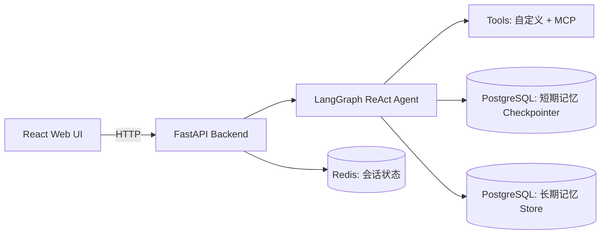

# ReAct Agent 多会话智能体系统（支持 HITL / MCP / 长短期记忆）

一个可直接落地的 Agent 工程实践项目：基于 `FastAPI + LangGraph + ReAct`，实现了多用户多会话、HITL 人工审查、MCP 工具接入、PostgreSQL 记忆持久化与 Redis 会话恢复，并提供了简约风 `React Web UI`。


---

## 项目亮点

- **完整 Agent 服务化**：后端 API 化部署，支持中断、恢复、状态查询、会话管理。
- **HITL 人工审查闭环**：工具调用可中断，支持 `accept / reject / edit / response` 四种决策。
- **多会话容灾恢复**：Redis 持久化会话状态，前端异常退出后仍可恢复会话。
- **长短期记忆分层**：
  - 短期记忆（会话上下文）使用 LangGraph Checkpointer + PostgreSQL
  - 长期记忆（用户偏好等）使用 LangGraph Store + PostgreSQL
- **工具生态可扩展**：支持自定义工具 + MCP Server 工具（如高德地图）。
- **多模型适配**：支持 OpenAI、通义千问、Ollama、OneAPI。
- **前后端分离**：FastAPI 后端 + React Web UI，便于二次开发。

---

## 系统架构



---

## 核心功能清单

### 1) Agent 调用与中断恢复
- 运行智能体：`/agent/invoke`
- 中断恢复：`/agent/resume`
- HITL 四种审查类型：
  - `accept`：允许调用工具
  - `reject`：拒绝调用工具
  - `edit`：修改参数后调用
  - `response`：不调用工具，直接给反馈

### 2) 多用户多会话管理
- 获取会话状态：`/agent/status/{user_id}/{session_id}`
- 获取最近活跃会话：`/agent/active/sessionid/{user_id}`
- 获取用户历史会话：`/agent/sessionids/{user_id}`
- 删除会话：`/agent/session/{user_id}/{session_id}`
- 系统概览：`/system/info`

### 3) 记忆能力
- **短期记忆**：自动记录会话上下文，支持裁剪消息降低上下文开销
- **长期记忆**：支持用户偏好写入与读取（如回答风格、业务背景）

### 4) 工具能力
- 自定义工具：例如 `book_hotel`、`multiply`
- MCP 工具：接入高德地图 MCP，用于地点检索等真实场景

---

## 项目目录结构

```text
05_ReActAgentHILApiMultiSession/
├── 01_backendServer.py          # FastAPI 后端主服务
├── requirements.txt             # Python 依赖清单
├── utils/
│   ├── config.py                # 全局配置
│   ├── llms.py                  # 多模型初始化
│   └── tools.py                 # 工具注册 + HITL 包装
├── web-ui/                      # React 前端（Vite）
├── docker/
│   ├── postgresql/
│   └── redis/
├── logfile/
└── .env
```

---

## 技术栈

- **Backend**: `Python`, `FastAPI`, `Uvicorn`
- **Agent**: `LangGraph`, `ReAct`, `LangChain`
- **Storage**: `PostgreSQL`, `Redis`
- **Frontend**: `React`, `TypeScript`, `Vite`
- **Tooling**: `MCP`, `ConcurrentRotatingFileHandler`, `Docker Compose`

---

## 快速启动

### 1) 准备环境

- Python 3.10+
- Node.js 18+
- PostgreSQL
- Redis

### 2) 配置环境变量

在项目根目录创建/修改 `.env`：

```env
DASHSCOPE_API_KEY=your_dashscope_key
AMAP_MAPS_API_KEY=your_amap_key
```

如需自定义数据库连接，请在 `utils/config.py` 中调整：
- `DB_URI`
- Redis 地址与端口
- `LLM_TYPE`

### 3) 启动后端

```bash
python 01_backendServer.py
```

默认启动地址：`http://localhost:8001`

### 4) 启动前端

```bash
cd web-ui
npm install
npm run dev
```

默认前端地址：`http://localhost:5173`

---

## API 示例（最常用）

### 调用智能体

`POST /agent/invoke`

```json
{
  "user_id": "user_001",
  "session_id": "session_001",
  "query": "帮我订汉庭酒店",
  "system_message": "你会使用工具来帮助用户。如果工具使用被拒绝，请提示用户。"
}
```

### 恢复中断

`POST /agent/resume`

```json
{
  "user_id": "user_001",
  "session_id": "session_001",
  "response_type": "edit",
  "args": {
    "args": {
      "hotel_name": "汉庭酒店(软件园店)"
    }
  }
}
```

---

## 典型流程

1. 用户发起问题，后端创建/更新会话状态为 `running`
2. Agent 推理并计划工具调用
3. 工具调用前触发 HITL 中断，前端收到 `interrupted`
4. 用户在前端审批（accept/reject/edit/response）
5. 后端 `resume` 执行，最终 `completed` 并写回 Redis
6. 用户可随时通过状态接口恢复历史会话

---

## 可扩展方向

- 增加 `JWT/RBAC` 实现多租户权限隔离
- 接入向量数据库，增强长期记忆检索
- 增加可观测性（Tracing / Metrics / Prompt Logging）
- 支持流式输出（SSE / WebSocket）
- 增加自动化测试与 CI/CD

---

## 项目价值总结

这个项目展示了一套**可运行、可恢复、可扩展、可审查**的 Agent 工程系统，覆盖了从模型、工具、记忆到前后端交互和状态管理的完整链路。
